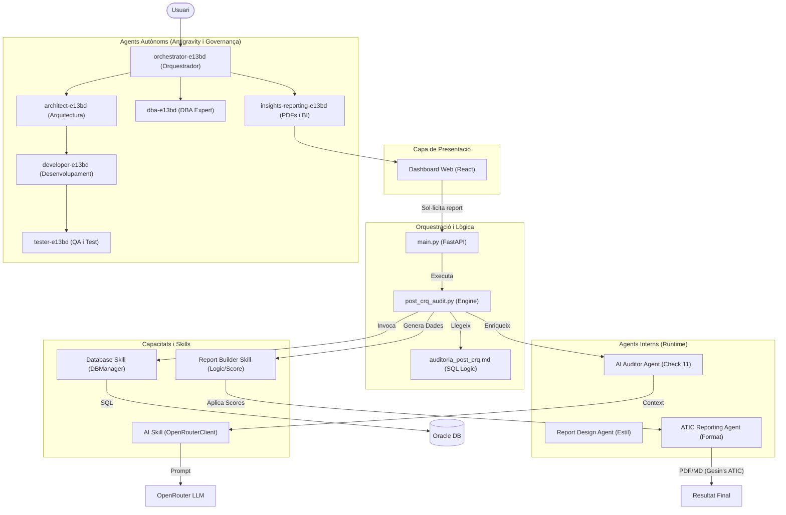
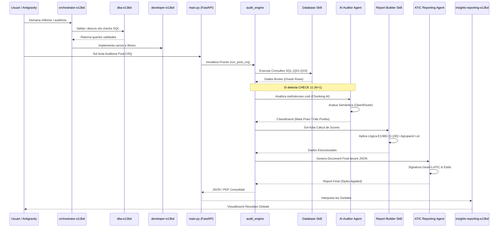

# Documentació Tècnica: Sistema d'Auditoria BBDD (Post-CRQ)

Aquesta documentació detalla el funcionament, l'arquitectura i la integració amb Intel·ligència Artificial del sistema d'Auditoria Post-CRQ per a bases de dades Oracle (E13BD).

## 1. Resum executiu
- **Arquitectura**: El sistema separa la definició lògica (SQL en Markdown) de l'execució tècnica (Python).
- **Flux Principal**: Lectura de Markdown -> Filtratge temporal/esquema -> Execució SQL a Oracle -> Anàlisi IA (Check 11) -> Generació de Report.
- **Integració IA**: El CHECK 11 detecta patrons N+1 ineficients i utilitza **OpenRouter** per classificar-los semànticament, reduint la càrrega de revisió manual del DBA.
- **Resiliència**: El client d'IA inclou mecanismes de *fallback* a models gratuïts i gestió d'errors per no interrompre l'auditoria si l'API falla.

## 2. Inventari complet de fitxers implicats

| Ruta | Nom | Tipus | Estat | Rol dins la funcionalitat |
| :--- | :--- | :--- | :--- | :--- |
| `/` | `auditoria_post_crq.md` | SQL/Doc | `existent` | Font de veritat dels SQL. |
| `/` | `consultes_post_crq.txt` | Catàleg | `existent` | Índex per al motor de l'API. |
| `src/api/` | `post_crq_audit.py` | Python | `existent` | Orquestrador i motor d'execució. |
| `src/api/` | `post_crq_check11_ai.py` | Python | `existent` | Lògica de preparació i anàlisi IA. |
| `src/core/` | `openrouter_client.py` | Python | `existent` | Client de comunicació amb l'LLM. |
| `src/core/` | `report_design_agent.py` | Python | `existent` | Agent de disseny que dicta l'estructura dinàmica dels informes PDF i Markdown. |
| `config/` | `.env` | Config | `existent` | Variables d'entorn i claus API. |
| `src/api/` | `main.py` | Python | `existent` | Punt d'entrada de l'API FastAPI. |
| `src/api/` | `report_builder.py` | Python | `refactoritzat` | Genera els documents finals. |
| `src/web-app/src/views/` | `MailConfigView.jsx` | React | `nou` | Secció dedicada a la configuració global de notificacions (SMTP, Teams, SP). |
| `tests/` | `test_check11_ai.py` | Test | `existent` | Validació de la integració IA. |
| `src/core/` | `db_manager.py` | Python | `existent` | Gestor de connexions Oracle. |

## 3. Explicació detallada fitxer a fitxer

### `auditoria_post_crq.md`
- **Funció**: Defineix els algorismes de detecció en SQL pur.
- **Entrades**: Bind variables com `:days_back`.
- **Impacte CHECK 11**: Conté la consulta complexa que identifica operacions SQL dins de línies de codi properes a un `LOOP`.

### `src/api/post_crq_audit.py`
- **Funció**: Orquestra tot el procés. Parseja el Markdown i executa les consultes en paral·lel.
- **Què hi passa dins**: Si el `check_id` és `CHECK_11`, invoca el mòdul d'IA després de rebre les dades d'Oracle.
- **Sortides**: Retorna un diccionari amb els resultats enriquits.

### `src/api/post_crq_check11_ai.py`
- **Funció**: "Traductor" entre dades SQL i llenguatge natural.
- **Què hi passa dins**: Construeix el prompt, envia els fragments de codi (`linies_detall`) a l'IA i interpreta el JSON de tornada.
- **Impacte IA**: Defineix el `SYSTEM_PROMPT` que categoritza el risc.

### `src/core/report_design_agent.py` & `src/api/report_builder.py`
- **Funció**: `ReportDesignAgent` actua com a cervell de disseny que exposa un JSON de configuració de seccions de report.
- **Què hi passa dins**: `report_builder.py` rep la informació i itera de manera dinàmica per generar l'HTML, el Markdown o el PDF d'acord amb el disseny subministrat.

### `src/web-app/src/views/MailConfigView.jsx`
- **Funció**: Mòdul central de governança de notificacions.
- **Què hi passa dins**: Gestiona la configuració global dels canals (Smtp, Teams, SharePoint). Separa la configuració tècnica de la de negoci.
- **Impacte**: Desacobla la configuració de la vista d'automatitzacions, millorant la UX/UI i la facilitat d'edició.

## 4. Relació entre fitxers i components
El sistema es basa en un acoblament flexible:
- **Flux de dades**: `Markdown` -> `Audit Orchestrator` -> `Oracle DB` -> `Data Enrichment (IA)` -> `Report Design Agent` -> `Report Builder`.
- **Flux de control**: L'orquestrador (`post_crq_audit.py`) controla el paral·lelisme i decideix si crida a l'IA segons si hi ha files al CHECK 11 i si `OPENROUTER_ENABLED` és cert.
- **Renderització**: L'estructura de l'informe depèn completament del `ReportDesignAgent`, el qual defineix en format llista interactiva les seccions (Context, Summary, Metrics, AI Diagnostics) i l'estil, perquè el `builder` generi el PDF o MD recursivament.

## 5. Diagrama Mermaid de components (Arquitectura d'Agents i Skills)

## 6. Diagrama Mermaid del flux d’execució (Agentic Flow)

## 7. Guia pas a pas
1. **Definició**: S'afegeix o modifica un check a `auditoria_post_crq.md`.
2. **Setup**: Es configura la `OPENROUTER_API_KEY` al `.env`.
3. **Crida**: Es demana l'execució via Swagger o Dashboard UI.
4. **Processament**: El sistema filtra per esquemes i rang temporal.
5. **IA**: Per cada fila del CHECK 11, l'IA avalua si és `mala_praxis` (risc real) o `falso_positivo`.
6. **Resultat**: Es lliura un JSON consolidat.

## 8. Configuració i Variables d’Entorn

| Variable | Obligada | Descripció | On s'utilitza |
| :--- | :--- | :--- | :--- |
| `OPENROUTER_API_KEY` | Sí | Clau per analitzar el codi PL/SQL via OpenRouter. | `openrouter_client.py` |
| `AI_MODEL` | No | Model d'IA utilitzat (per defecte meta-llama/llama-3.3-70b-instruct:free). | `openrouter_client.py` |
| `OPENROUTER_ENABLED` | No | Si és `False`, el CHECK 11 no tindrà anàlisi d'IA. | `post_crq_audit.py` |
| `OPENROUTER_TIMEOUT_MS` | No | Temps d'espera (ms) per a la resposta de l'IA. | `openrouter_client.py` |

## 9. Scripts i Punts d’Entrada
- **API**: `uvicorn src.api.main:app --reload`.
- **Endpoint**: `/api/audit/post-crq/run`.
- **Paràmetres**: `profile` (connexió), `days_back`, `schemas`.

## 10. Validacions i tests
El fitxer `tests/test_check11_ai.py` valida:
- Que el parser de Markdown detecti el CHECK 11.
- Que la resposta de l'IA es fusioni correctament amb les columnes d'Oracle.
- El comportament quan l'API Key és invàlida (error controlat).

## 11. Buits, riscos i dependències
- **Falsos segons**: Un timeout a l'API d'OpenRouter pot deixar el CHECK 11 sense anàlisi IA.
- **Buits**: Caldria implementar un sistema de **caching** per no re-analitzar codi que no ha canviat.
- **Risc**: Seguretat del codi enviat a una API externa (revisar polítiques de privacitat).

## 12. Resum final accionable
- **Fitxers Crítics**: `post_crq_audit.py` i `auditoria_post_crq.md`.
- **Lectura recomanada**: Començar pel Markdown per entendre la lògica DB i seguir per `post_crq_check11_ai.py` per l'anàlisi semàntic.
- **Propers Passos**: Implementar visualització HUD al frontend per als resultats d'IA.
