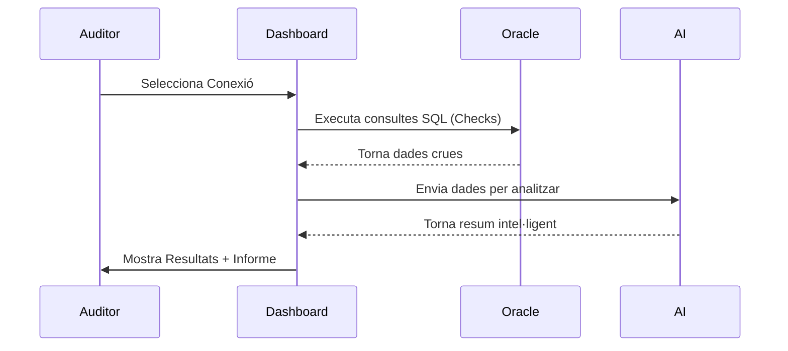

# Introducció

El **Dashboard E13BD** neix de la necessitat de centralitzar i modernitzar les tasques d'auditoria de codi i objectes en entorns Oracle. 

## Objectius del Sistema

- **Eficiència**: Reduir el temps dedicat a l'anàlisi manual d'errors de base de dades.
- **Governança**: Mantenir un registre històric de l'estat dels objectes i checks realitzats.
- **Claredat**: Transformar logs complexos en visualitzacions interactives i fàcils d'entendre.

## Flux de Treball

El procés estàndard de l'aplicació segueix aquest esquema:

## Beneficis Clau

1. **Interfície Moderna**: Basada en tecnologies web d'última generació.
2. **Checks Personalitzables**: Capacitat per afegir nous criteris d'auditoria fàcilment.
3. **Resums amb IA**: L'agent d'intel·ligència artificial ajuda a prioritzar els errors més crítics.
