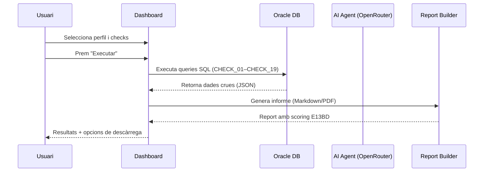

# Auditoria BBDD (Post-CRQ)

El mòdul d'**Auditoria BBDD** és el nucli central del Dashboard E13BD. Executa una sèrie de checks tècnics sobre una base de dades Oracle per verificar la qualitat i integritat dels objectes desplegats en un canvi de release (CRQ).

## Flux de treball

## Paràmetres de configuració

### Selecció de connexió

- **Control**: Desplegable `Base de dades`
- **Funció**: Tria el perfil Oracle sobre el qual s'executarà l'auditoria
- **Prerequisit**: Cal tenir almenys un perfil creat a [Configuració](./07-configuracion.md)

### Filtre d'esquemes (opcional)

- **Camp**: `Esquemes opcionals` (text monospace)
- **Format**: Llista separada per comes en majúscules: `APP_USER, CORE_DB`
- **Comportament per defecte**: Si es deixa buit, Oracle retorna tots els objectes visibles per l'usuari de connexió

### Finestra temporal

El sistema suporta dos modes de filtre temporal:

| Mode | Descripció | Exemple |
|------|-----------|---------|
| **Preset** | Intervals predefinits | `Diari`, `Setmanal`, `Mensual` |
| **Rang** | Dates d'inici i fi manuals | `2026-01-15` → `2026-01-20` |

### Opcions de planificador (scheduler)

La secció de configuració avançada permet ajustar la concurrència d'execució dels checks:

| Paràmetre | Descripció | Default |
|-----------|-----------|---------|
| `max_concurrency` | Threads globals simultanis | 2 |
| `max_heavy_concurrency` | Threads per checks pesats | 1 |
| `max_medium_concurrency` | Threads per checks mitjans | 1 |
| `max_light_concurrency` | Threads per checks lleugers | 2 |
| `max_retries` | Reintents per check fallat | 1 |
| `enable_auto_throttle` | Reducció automàtica de càrrega | Activat |

> [!WARNING]
> La configuració `Agressiu` (concurrència alta sense auto-throttle) pot generar tensió en sessions, CPU o I/O d'Oracle. S'ha d'usar només amb observabilitat activa.

## Llista de checks (Q01–Q19)

Cada check té:
- **Identificador**: Format `CHECK_XX` o `Q_XX`
- **Títol**: Descripció funcional llegible
- **Criticitat**: Determina la gravetat del problema si el check falla

### Nivells de criticitat

| Nivell | Codi intern | Color UI | Significat |
|--------|-------------|----------|-----------|
| 🔴 Crític | `CRITIC` | Vermell intens | Problema que requereix acció immediata |
| 🟠 Mitjà | `MITJA` | Taronja | Possible impacte, cal revisió |
| 🔵 Baix | `BAIX` | Blau clar | Millora recomanable, no urgent |

### Selecció de checks

| Acció | Descripció |
|-------|-----------|
| Casella individual | Activa/desactiva un check específic |
| **Seleccionar tots** | Marca tots els checks disponibles |
| **Netejar selecció** | Desactiva tots els checks |
| **Sinc. Checks** | Recarrega la llista des del fitxer Markdown font |

> [!NOTE]
> La llista de checks prové del fitxer `auditoria_post_crq.md`. Si s'ha afegit o modificat un check al document, cal prémer **Sinc. Checks** per actualitzar la llista.

## Detall de checks rellevants

### CHECK_11: Problemes de codi en paquets/procedures/funcions

**Severitat**: ALT

Detecta la **proximitat heurística** entre sentències d'inici de bucle (`LOOP`, `FOR ... IN`) i operacions DML (`INSERT INTO`, `UPDATE`, `DELETE FROM`, `SELECT ... INTO`) en un radi de menys de **25 línies** dins d'objectes PL/SQL modificats recentment, sempre que el codi **no** usi `BULK COLLECT` ni `FORALL`.

**Com funciona** (SQL pur, sense IA):
1. Identifica les línies amb patrons `INICI_LOOP` i `DML_SOSPITOS` dins del codi font Oracle (`dba_source`).
2. Calcula la distància entre elles per objecte (PROCEDURE, FUNCTION, PACKAGE BODY, TRIGGER).
3. Si distància < 25 línies i no hi ha `BULK COLLECT` al mateix objecte → marca com a troballa.

**Columnes retornades**: `esquema`, `objecte`, `tipus`, `detall_auditoria`

> [!NOTE]
> El CHECK_11 és un check SQL estàndard. **No hi ha integració amb IA** en aquest check. El seu resultat és determinista i immediat.

### CHECK_12: Candidats per a Bulk Collect / càrrega massiva

**Severitat**: BAIX

Identifica codi PL/SQL que processa files una a una (`FETCH ... INTO` sense `BULK COLLECT`/`FORALL`), combinat amb DML o LOOPs. El resultat inclou la columna `recomanacio` amb la descripció del patró detectat.

**Columnes retornades**: `esquema`, `objecte`, `tipus`, `data_modificacio`, `te_bulk`, `recomanacio`

## Resultats d'execució

Un cop l'auditoria finalitza, la pantalla mostra:

### KPIs de troballes

| Comptador | Descripció |
|-----------|-----------|
| 🔴 Troballes crítiques | Total de problemes de criticitat `CRITIC` |
| 🟠 Troballes mitjanes | Total de problemes de criticitat `MITJA` |
| 🔵 Troballes baixes | Total de problemes de criticitat `BAIX` |

### Resum d'execució (Scheduler Summary)

- Durada total de l'execució (en ms, s o min)
- Nombre de checks executats correctament
- Nombre de checks fallats per error tècnic

### Taula de lots (Lot Summary)

Resultats agrupats per **lot de proveïdor**. Per cada lot es mostra:
- Identificador del lot
- Llista d'esquemes afectats
- Nombre d'objectes amb problemes
- Checks executats sobre aquest lot
- Criticitat màxima detectada
- Termini recomanat per a la resolució

### Detall tècnic per check

Taula expandible que mostra les files de dades retornades per Oracle per a cada check. Les columnes s'adapten dinàmicament als camps de cada query. Les columnes típiques inclouen: `OBJECTE`, `TIPUS`, `ESQUEMA`, `DADA TÈCNICA`, `OBSERVACIÓ`.
