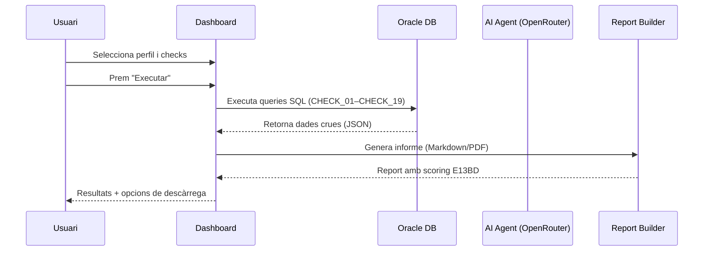
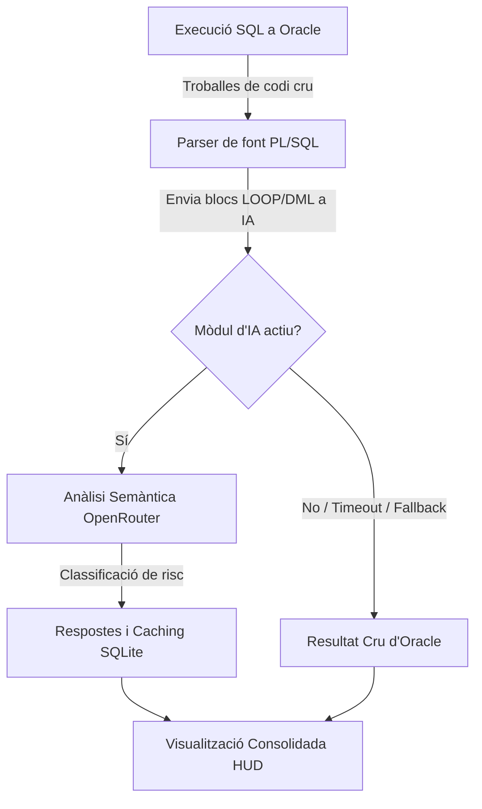

# Auditoria BBDD (Post-CRQ)

El mòdul d'**Auditoria BBDD** és el nucli central del Dashboard E13BD. Executa una sèrie de checks tècnics sobre una base de dades Oracle per verificar la qualitat i integritat dels objectes desplegats en un canvi de release (CRQ).

## Flux de treball

## Paràmetres de configuració

### Selecció de connexió

- **Control**: Desplegable `Base de dades`
- **Funció**: Tria el perfil Oracle sobre el qual s'executarà l'auditoria
- **Prerequisit**: Cal tenir almenys un perfil creat a [Configuració](./07-configuracion.md)

### Filtre d'esquemes (opcional)

- **Camp**: `Esquemes opcionals` (text monospace)
- **Format**: Llista separada per comes en majúscules: `APP_USER, CORE_DB`
- **Comportament per defecte**: Si es deixa buit, Oracle retorna tots els objectes visibles per l'usuari de connexió

### Finestra temporal i Paràmetres Dinàmics de Dates

Per evitar auditar innecessàriament objectes que no han estat modificats en el rang del canvi (CRQ), el sistema implementa filtres temporals robusts:

| Mode | Paràmetres Backend | Descripció | Ús / Exemple |
|------|--------------------|------------|--------------|
| **Preset** | `days_back` | Filtre relatiu basat en dies | `Diari` (1 dia), `Setmanal` (7 dies), `Mensual` (30 dies) |
| **Rang de dates** | `&start_at` i `&end_at` | Dates d'inici i fi reals | `2026-01-15` → `2026-01-20` (Format `YYYY-MM-DD`) |

> [!IMPORTANT]
> **Injecció de paràmetres dinàmics de data**: A les consultes mestre com el `CHECK_01` (i d'altres), el backend de FastAPI valida prèviament la integritat del format dels filtres temporals triats de la interfície. Posteriorment, injecta i enllaça de forma dinàmica i segura les variables `&start_at` i `&end_at` a la crida Oracle, prevenint qualsevol error de sintaxi SQL pre-execució i reduint el consum de CPU del motor Oracle.

### Opcions de planificador (scheduler)

La secció de configuració avançada permet ajustar la concurrència d'execució dels checks:

| Paràmetre | Descripció | Default |
|-----------|-----------|---------|
| `max_concurrency` | Threads globals simultanis | 2 |
| `max_heavy_concurrency` | Threads per checks pesats | 1 |
| `max_medium_concurrency` | Threads per checks mitjans | 1 |
| `max_light_concurrency` | Threads per checks lleugers | 2 |
| `max_retries` | Reintents per check fallat | 1 |
| `enable_auto_throttle` | Reducció automàtica de càrrega | Activat |

> [!WARNING]
> La configuració `Agressiu` (concurrència alta sense auto-throttle) pot generar tensió en sessions, CPU o I/O d'Oracle. S'ha d'usar només amb observabilitat activa.

## Llista de checks (Q01–Q19)

Cada check té:
- **Identificador**: Format `CHECK_XX` o `Q_XX`
- **Títol**: Descripció funcional llegible
- **Criticitat**: Determina la gravetat del problema si el check falla

### Nivells de criticitat

| Nivell | Codi intern | Color UI | Significat |
|--------|-------------|----------|-----------|
| 🔴 Crític | `CRITIC` | Vermell intens | Problema que requereix acció immediata |
| 🟠 Mitjà | `MITJA` | Taronja | Possible impacte, cal revisió |
| 🔵 Baix | `BAIX` | Blau clar | Millora recomanable, no urgent |

### Selecció de checks

| Acció | Descripció |
|-------|-----------|
| Casella individual | Activa/desactiva un check específic |
| **Seleccionar tots** | Marca tots els checks disponibles |
| **Netejar selecció** | Desactiva tots els checks |
| **Sinc. Checks** | Recarrega la llista des del fitxer Markdown font |

> [!NOTE]
> La llista de checks prové del fitxer `auditoria_post_crq.md`. Si s'ha afegit o modificat un check al document, cal prémer **Sinc. Checks** per actualitzar la llista.

## Detall de checks rellevants

### CHECK_11: Problemes de codi en paquets/procedures/funcions (Enriquit amb IA)

**Severitat**: ALT (🔴 **Crític**)

Aquest check detecta la **proximitat heurística** entre sentències d'inici de bucle (`LOOP`, `FOR ... IN`) i operacions DML (`INSERT INTO`, `UPDATE`, `DELETE FROM`, `SELECT ... INTO`) en un radi de menys de **25 línies** dins d'objectes PL/SQL modificats recentment (en el rang temporal de dades triat), sempre que el codi **no** usi operacions de càrrega massiva com `BULK COLLECT` o `FORALL`. Aquest patró genera greus colls d'ampolla a causa del canvi de context constant entre el motor PL/SQL i el motor SQL (problema conegut com a consulta asíncrona N+1).

#### Procés d'Execució en 2 Fases:

1. **Fase 1 — Detecció Determinista**: L'aplicació executa una query optimitzada a Oracle contra `dba_source` per extreure les línies de codi PL/SQL sospitoses amb LOOPs i DMLs molt propers, juntament amb el context de línies de l'objecte (procediment, funció, paquet).
2. **Fase 2 — Enriquiment i Classificació Semàntica (IA)**: El motor d'auditoria envia asíncronament els blocs de codi de cada troballa a l'assistent d'IA (`AIAssistant` via `OpenRouterClient`). L'IA analitza semànticament el flux del programa i el classifica en:
   - **`mala_praxis`**: Riscos de rendiment reals que requereixen refactorització a càrrega massiva.
   - **`falso_positivo`**: Fluxos on el bucle és extremadament curt (ex: 2 o 3 iteracions determinades per codi) o té finalitat de bypass vàlida.
   - L'IA genera a l'instant un **diagnòstic detallat i una proposta de codi refactoritzada** en llenguatge natural.

#### Caching d'Explicacions i Resiliència (Fallback)

- **Estalvi i Caching local**: Els diagnòstics i explicacions generats per l'IA per a un codi o objecte específic es guarden en una taula a la base de dades local **`internal.db`**. Si el codi d'aquell objecte no ha variat en auditories posteriors, el Dashboard reutilitza a l'instant el diagnòstic de la cache de SQLite, estalviant temps i costos de crides a l'API.
- **Mecanisme resilient de degradació (Fallback)**: Si no s'ha configurat cap `OPENROUTER_API_KEY`, si el servei d'OpenRouter dona un timeout, o s'esgoten les quotes, l'auditoria Post-CRQ **no es bloqueja ni falla**. El sistema processa la fallada de forma transparent, registra la incidència i presenta l'auditoria amb els resultats crus deterministes d'Oracle al Dashboard, garantint el govern de l'auditoria en qualsevol situació.

**Columnes retornades**: `esquema`, `objecte`, `tipus`, `detall_auditoria` (enriquit amb el JSON de diagnòstic d'IA, explicació i severitat semàntica).

### CHECK_12: Candidats per a Bulk Collect / càrrega massiva

**Severitat**: BAIX

Identifica codi PL/SQL que processa files una a una (`FETCH ... INTO` sense `BULK COLLECT`/`FORALL`), combinat amb DML o LOOPs. El resultat inclou la columna `recomanacio` amb la descripció del patró detectat.

**Columnes retornades**: `esquema`, `objecte`, `tipus`, `data_modificacio`, `te_bulk`, `recomanacio`

## Resultats d'execució

Un cop l'auditoria finalitza, la pantalla mostra:

### KPIs de troballes

| Comptador | Descripció |
|-----------|-----------|
| 🔴 Troballes crítiques | Total de problemes de criticitat `CRITIC` |
| 🟠 Troballes mitjanes | Total de problemes de criticitat `MITJA` |
| 🔵 Troballes baixes | Total de problemes de criticitat `BAIX` |

### Resum d'execució (Scheduler Summary)

- Durada total de l'execució (en ms, s o min)
- Nombre de checks executats correctament
- Nombre de checks fallats per error tècnic

### Taula de lots (Lot Summary)

Resultats agrupats per **lot de proveïdor**. Per cada lot es mostra:
- Identificador del lot
- Llista d'esquemes afectats
- Nombre d'objectes amb problemes
- Checks executats sobre aquest lot
- Criticitat màxima detectada
- Termini recomanat per a la resolució

### Detall tècnic per check

Taula expandible que mostra les files de dades retornades per Oracle per a cada check. Les columnes s'adapten dinàmicament als camps de cada query. Les columnes típiques inclouen: `OBJECTE`, `TIPUS`, `ESQUEMA`, `DADA TÈCNICA`, `OBSERVACIÓ`.
