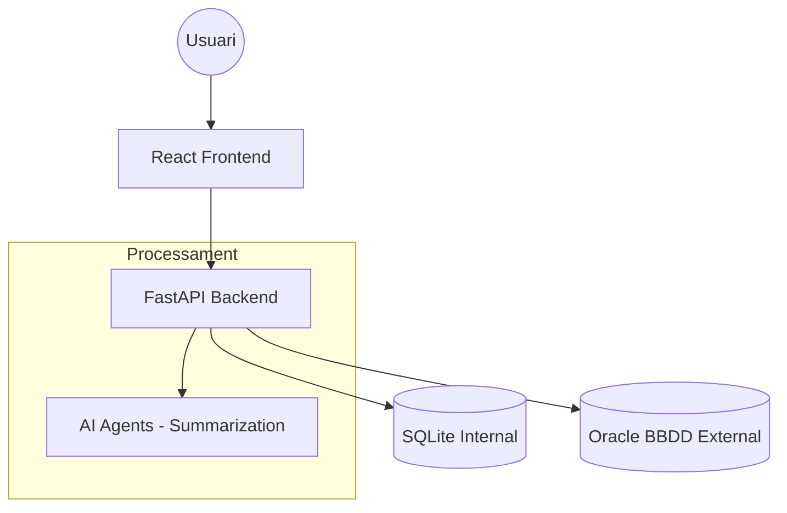

# Arquitectura del Sistema

El **Dashboard E13BD** està dissenyat com una aplicació web moderna i escalable.

## Diagrama de Flux

A continuació es mostra com interactuen els diferents components:

## Components Tècnics

- **Frontend**: Desenvolupat amb React + Vite + Tailwind CSS.
- **Backend**: Basat en FastAPI per a un rendiment asíncron òptim.
- **Base de Dades**: 
  - **SQLite**: Per a l'emmagatzematge local de configuracions i històric.
  - **Oracle**: La font de dades que s'audita.
- **IA**: Integració amb agents de llenguatge per a la generació automàtica de resums i anàlisi de resultats.
