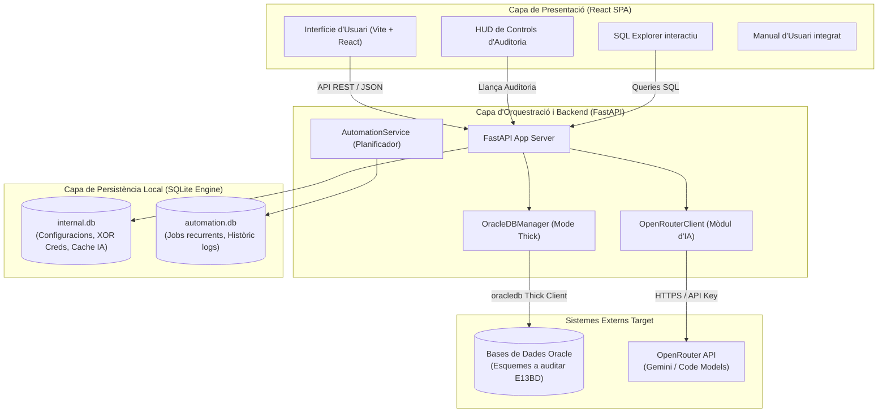
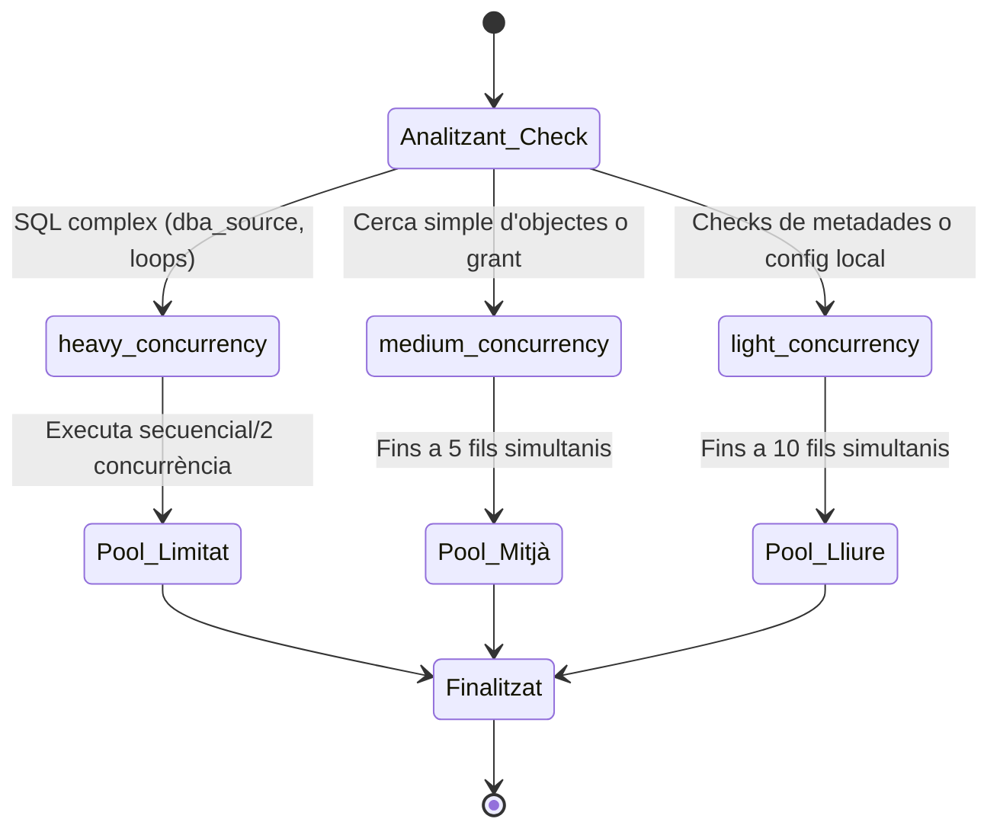
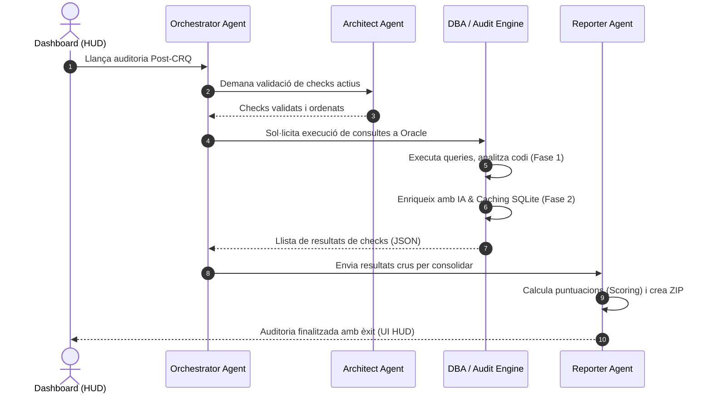

# Arquitectura del Sistema (v4.6)

El **Dashboard E13BD** s'organitza s'estructura sota un model de **microserveis local centralitzat** que combina un frontend de tipus Single Page Application (SPA), un backend asíncron en FastAPI i un motor dual de persistència local per oferir un govern d'auditoria robust, resilient i segur de les bases de dades Oracle d'alta criticitat.

---

## Diagrama de Flux i Arquitectura de Components

L'aplicació es divideix en capes clarament desacoblades, comunicades a través d'una API REST interna sobre FastAPI:

---

## 1. Persistència Local Dual (SQLite Engine)

Per evitar sobrecarregar les bases de dades corporatives de producció i independitzar les configuracions d'auditoria local de qualsevol canvi extern, l'aplicació implementa un motor dual de fitxers SQLite independents:

### A. Base de Dades de Configuració (`internal.db`)
- **Funció**: Persisteix l'estat local de l'aplicació.
- **Dades emmagatzemades**:
  - **Catàleg de Checks**: importat dinàmicament des d'`auditoria_post_crq.md`.
  - **Credencials Oracle**: credencials ofuscades amb XOR (`crypto_utils.py`) per a connexions.
  - **Configuracions globals**: variables del model d'IA d'OpenRouter, credencials de correu SMTP i canals de Microsoft Teams per a alertes.
  - **Cache d'IA**: taula amb l'històric d'explicacions i catalogacions del `CHECK_11` per estalviar costos i millorar la velocitat de l'auditoria.

### B. Base de Dades d'Automatització (`automation.db`)
- **Funció**: Orquestra les tasques asíncrones de fons.
- **Dades emmagatzemades**:
  - **Scheduler**: llistat de jobs programats (diaris, setmanals, mensuals).
  - **Històric**: logs d'execucions anteriors, fitxers desats en zip de resultats d'auditoria i estats de finalització de check.

---

## 2. Scheduler Concurrent Asíncron

El processament de checks a gran escala contra instàncies complexes d'Oracle pot generar pics de càrrega. L'aplicació compta amb un planificador concurrent (`AutomationService`) integrat directament al backend que optimitza les connexions gràcies a un pool de sessions adaptatiu i a la catalogació de checks segons l'ús de CPU a Oracle:

- **`heavy_concurrency`**: Checks com el `CHECK_11` (lectura completa de codi font) o el `CHECK_01` (dates de modificació en taules gegants) que es processen en fils altament controlats per evitar la saturació.
- **`medium_concurrency`**: Cerca d'objectes i taules intermèdies.
- **`light_concurrency`**: Validacions d'esquemes o paràmetres locals ràpids.

---

## 3. Arquitectura d'IA Resilient (OpenRouter)

El backend incorpora un mòdul d'IA resilient (`OpenRouterClient`) per donar resposta al diagnòstic semàntic de codi. Aquest component implementa:
1. **Degradació Elegant (Graceful Fallback)**: si OpenRouter està desconnectat, la API key és invàlida o es consumeix la quota del model gratuït (`google/gemini-2.0-flash-lite-preview-02-05:free`), el sistema no es deté; simplement omple la columna d'IA com a "Sense dades (IA inactiva)" i envia els resultats crus directament al frontend.
2. **Control estricte de Timeout**: per evitar esperes indefinides a l'usuari final, cada crida a OpenRouter té un límit màxim configurat per variable d'entorn (`OPENROUTER_TIMEOUT_MS`).

---

## 4. Flux de Govern de l'Auditoria i Orquestració d'Agents

Quan el Dashboard executa una auditoria completa, s'activen dinàmicament **quatre agents interns especialitzats** (basats en els rols de disseny E13BD):

1. **Orchestrator Agent**: rep la sol·licitud inicial del dashboard, llegeix el rang temporal triat (`&start_at` / `&end_at`) i és l'encarregat d'iniciar el fil d'execució asíncron.
2. **Architect Agent**: comprova l'alineament dels checks definits a la base de dades sqlite local amb el document markdown `auditoria_post_crq.md` de control mestre.
3. **DBA / Audit Engine Agent**: executa el processament dels checks definits de forma asíncrona i concurrent contra les bases de dades Oracle d'E13BD. Aplica el filtre de dates dinàmic directament a la crida Oracle i gestiona la fase d'IA del `CHECK_11`.
4. **Reporter Agent**: rep les respostes de l'Audit Engine, realitza l'esquema de scoring per a la valoració del risc corporatiu i s'encarrega d'estructurar el fitxer zip d'informe.
